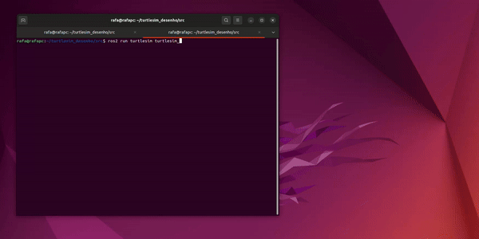

# Desenhando com Turtlesim

O objetivo da atividade é garantir o aprendizado dos conceitos básicos do ROS.



Para assistir o vídeo completo de demonstração, clique [aqui](https://drive.google.com/file/d/1StOOW8zUyuihioQBaf2mprkNmfVk-N2n/view?usp=sharing)

---

## Funcionalidades

- **Spawn Turtle**: Este método cria uma nova tartaruga chamada 'artista' na posição (4.0, 2.0) no ambiente TurtleSim.
- **Kill Turtle**: Este método remove a tartaruga 'artista' do ambiente.
- **Set Pen Color**: Este método configura a cor da caneta usada pela tartaruga 'artista' para desenhar.
- **Draw Circle**: Este método controla a tartaruga para desenhar um círculo no ambiente TurtleSim.

---

## Instalação

Certifique-se de ter o ROS2 instalado em seu sistema. Além disso, certifique-se de ter todas as dependências instaladas, elas estão disponíveis no arquivo `requirements.txt` na raíz do projeto.


1. Clone este repositório em seu ambiente:


```bash
git clone https://github.com/rafaelarojas/turtlesim_desenho.git
```


2. Navegue até o diretório do código:


```bash
cd turtlesim_desenho/src
```


3. Compile o código:


```bash
colcon build
```


4. Ative o ambiente do ROS2:


```bash
source install/setup.bash
```

---

## Executar

Para executar, confira se está dentro da pasta src.

1. Compile o código:


```bash
colcon build
```


2. Abra um terminal e digite:


```bash
ros2 run turtlesim turtlesim_node
```


3. Abra outro terminal e digite:


```bash
ros2 run turtle_pkg turtle
